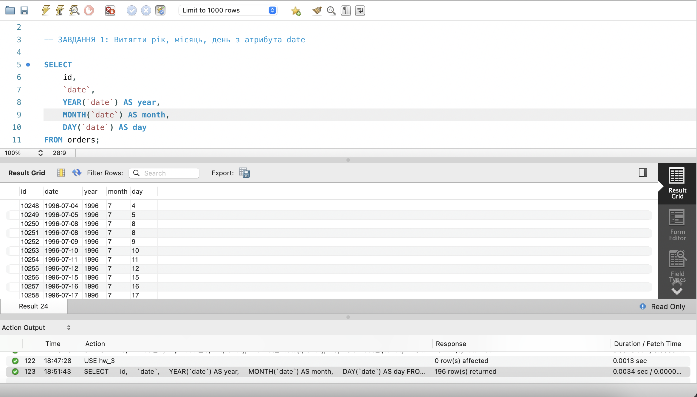
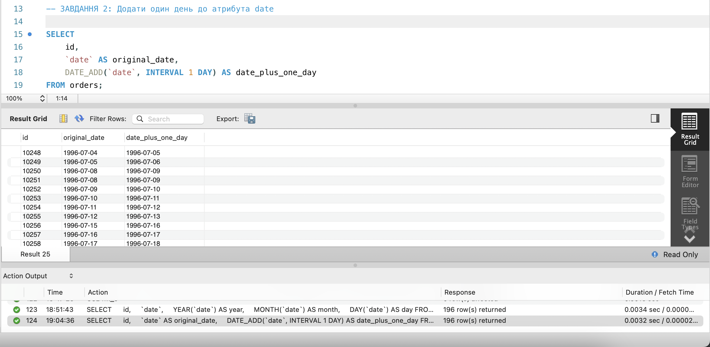
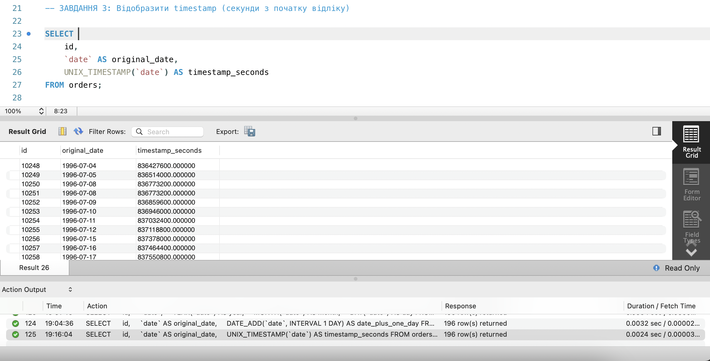
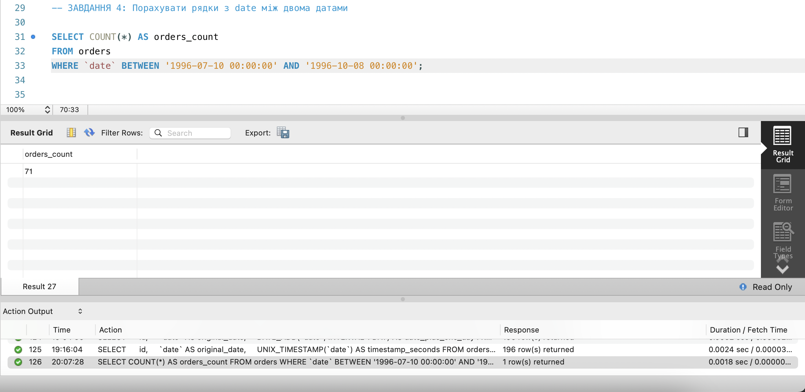
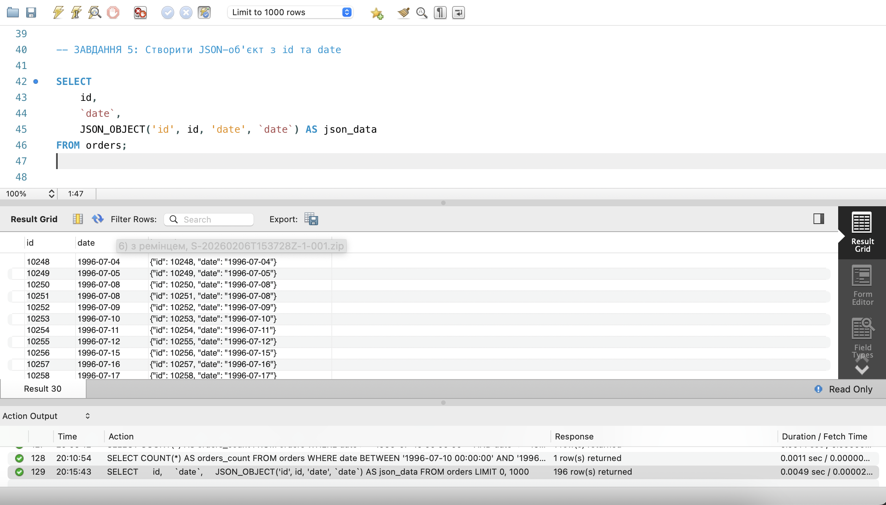

# Звіт до виконання домашнього завдання на тему: "Додаткові вбудовані SQL функції. Робота з часом"

---

## Завдання 1: Витягти рік, місяць, день з date

### Опис завдання
Для таблиці 'orders' з атрибута 'date' витягти рік, місяць і число. Вивести 'id', оригінальний 'date' та три нові атрибути.

### Результат виконання:
Було вивведено 5 колонок, а саме: 'id', 'date', 'year', 'month', 'day'

**Скриншот:**

'p1_split_date.png'

---

## Завдання 2: Додати один день до дати

### Опис завдання
До атрибута 'date' додати один день. Вивести 'id', оригінальний 'date' та результат додавання.

### Результат виконання:
Було вивведено 3 колонки, а саме: 'id', 'original_date', 'date_plus_one_day'

**Скриншот:**

'p2_increment_day_in_date.png'

---

## Завдання 3: Отримати timestamp (секунди з 1970)

### Опис завдання
Для атрибута 'date' відобразити кількість секунд з початку відліку Unix (01.01.1970 00:00:00 UTC).

### Результат виконання:
Було виведено 3 колонки, а саме: 'id', 'original_date', 'timestamp_seconds'

**Скриншот:**

'p3_date_to_timestamp.png'

---

## Завдання 4: Порахувати рядки між датами

### Опис завдання
Порахувати скільки таблиця 'orders' містить рядків з 'date' між '1996-07-10 00:00:00' та '1996-10-08 00:00:00'.

### Результат виконання:
Було виведено одне число - кількість замовлень у вказаному періоді

**Скриншот:**

'p4_count_between_dates.png'

---

## Завдання 5: Створити JSON-об'єкт

### Опис завдання
Для таблиці 'orders' вивести 'id', 'date' та JSON-об'єкт '{"id": <id>, "date": <date>}'.

### Результат виконання:
Було виведено 3 колонки, а саме: 'id', 'date', 'json_data'

**Скриншот:**

'p5_create_json_object.png'

---
